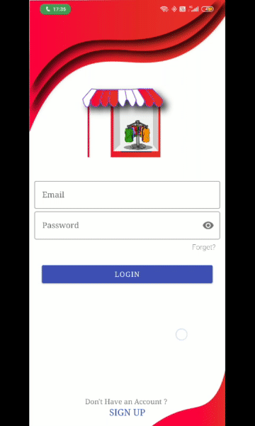
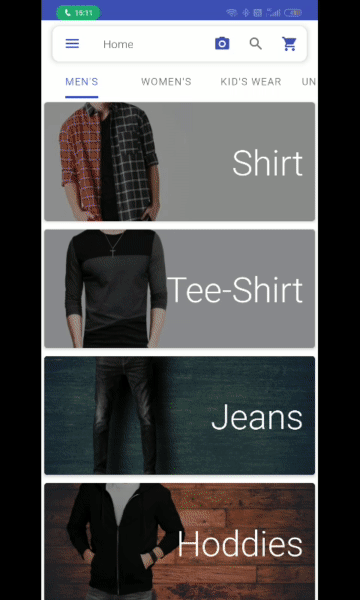
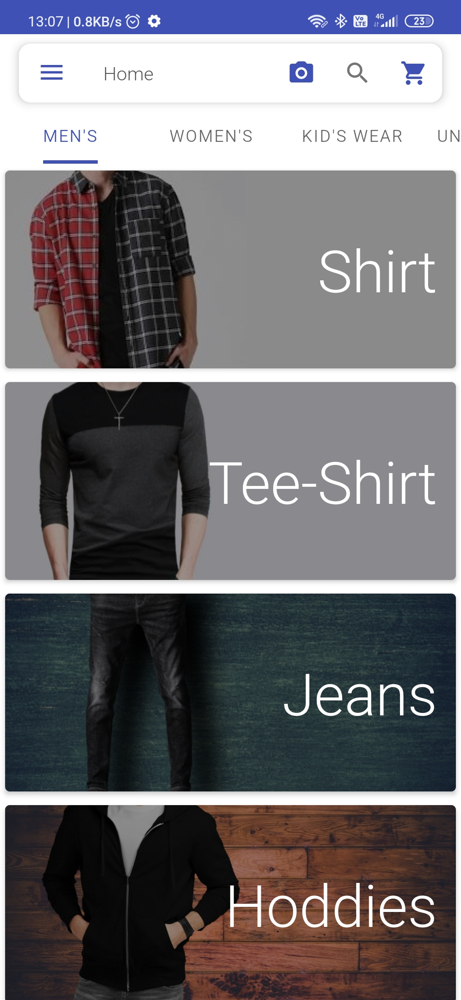
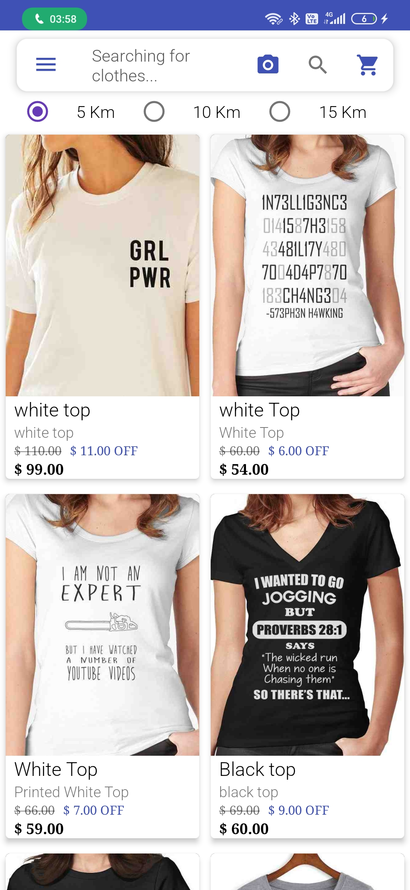
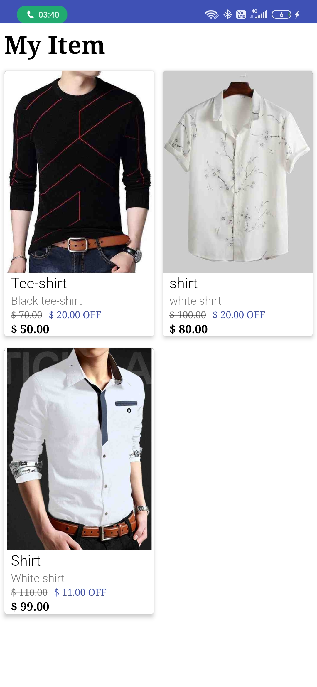

# Go Online
#### Go Online is an android application which is used to help nearby local store only for clothes, to register their products in the app and normal user can find those products in the application and check in which store this product available.

# Overview
- This application has radius-based filtering means user can only see those products which are available in those shops which are in the radius of 5 km and 10 km and 15 km of the as he chooses the option.

- This application also has a feature of image based searching user can search the product with the image. 

- This application has very simple interface and interactive User Interface for users and shopkeeper both.

- ## Authentication
  - Go Online Has provided very simple Authentication Process user just have to Sign up with their mail.

  - After Signup, Application Will fetch User Current Location and save that location In the database and use that location later to find near by shop around the user.

  - And User has Registered Successfully.
- Now, User can explore the application Find clothing products in minutes with user friendly User Interface 

- User can search things Easily in the application for that I have made a lot of filtering options like radius based filtering, gender based filtering, Clothes type filtering like Shirt, Tee-shirts etc.

- User can also search with text based search and image based search.
- ## Shop Registration
  - Shop Registration is also very user friendly in the application.

  - After Registering himself as a normal user, shopkeeper easily register themselves as a shop owner in the application by just clicking the Ham burger icon at top-left corner  and from that navigation drawer choose shop registration.

  - It will automatically fetch your current location and ask for your contact number and shop name, then we will verify the number with the otp. This otp is basically sent by firebase server I have used that firebase phone authentication library to sent otp.
  - After verify themselves All the Shopkeeper data will be uploaded to cloud firestore which I have used as database.

  - Now, Shopkeeper have done with their registration. 

  - I have Provided Shopkeeper a different Dashboard Section Where they can add new products, see their profile, change their Shop Address, Also See their previously Added Product.

## Image Based Search

**Creating Model** : I have to train clothes images which are my training images approx. 100 images for particular label for that I have used google teachable machine in Which I upload my all-training images and provide the labels and it will train my images and provide me my trained model.

**Downloading and putting in assets** :   I just download the floating point TFlite model from there. TFlite is basically TensorFlow lite models which we used in mobile application to recognize places, voices, objects, products. After downloading the model, I copy the model in my assets directory of my android projects file. You can see this assets directory in this navigation drawer on android studio.

**Convert image and input** : I wrote the coding part by taking the help of firebase model interpreter to interpret my model. These are the firebase model interpreter class by these objects I can open my model in the application and after then I will pass  the image as a input in the function or Also I have to change that image into floating array of 4 dimensional array of floating point values and after that I can give this image in the form of 4 dimensional floating point array of which I have created by the input image which is selected by user to search then after model will run and recognize the image and find the similar floating point array in the model also that would be created when I trained my model with my training images.

**Taking Output as a label and accuracy** : After that model will return a 2-dimensional floating-point array in which I have the accuracy and label and from this whole array I just take out the label which have maximum accuracy. Show that label to the user and search the images in my app regarding that label.
# Demo
[**See On Youtube**](https://youtu.be/zskc0mlxDU8?list=PLZ_JS_kELRStm4g9MugJ6QIEZ5PQXyGgN)
<table>
  <tr>
    <th>Sign Up and MainActivity</th>
    <th>Product detail</th>
  </tr>
  <tr>
    <td></td>
    <td></td>

  </tr>
</table>
<table>
  <tr>
    <th>Cart Activity & Favourite Activity</th>
      <th>Explore Application</th>
  </tr>
  <tr>
    <td></td>
    <td></td>
  </tr>
</table>

<table>
  <tr>
    <th>Image Based Search</th>
  </tr>
  <tr>
    <td></td>
  </tr>
</table>

# Screenshots

<table>
  <tr>
    <th>Sing up Activity</th>
    <th>Home Screen Activity</th>
    <th>Navigation Drawer</th>
  </tr>
  <tr>
    <td></td>
    <td></td>
    <td></td>
  </tr>
</table>

<table>
  <tr>
    <th>Mens Fragment</th>
    <th>Womens Fragment</th>
    <th>Category Navigation Drawer</th>
  </tr>
  <tr>
    <td></td>
    <td></td>
    <td></td>
  </tr>
</table>

<table>
  <tr>
    <th>Top's Recycler</th>
    <th>Description Activity (up)</th>
    <th>Description Activity (down)</th>
  </tr>
  <tr>
    <td></td>
    <td></td>
    <td></td>
  </tr>
</table>

<table>
  <tr>
    <th>Shop Registration</th>
    <th>Shop Owner Dashboard</th>
    <th>Add Product</th>
  </tr>
  <tr>
    <td></td>
    <td></td>
    <td></td>
   
  </tr>
</table>

<table>
  <tr>
    <th>Shop Owner Products</th>
    <th>Cart Activity</th>
  </tr>
  <tr>
     <td></td>
    <td></td>
  </tr>
</table>
        

  
